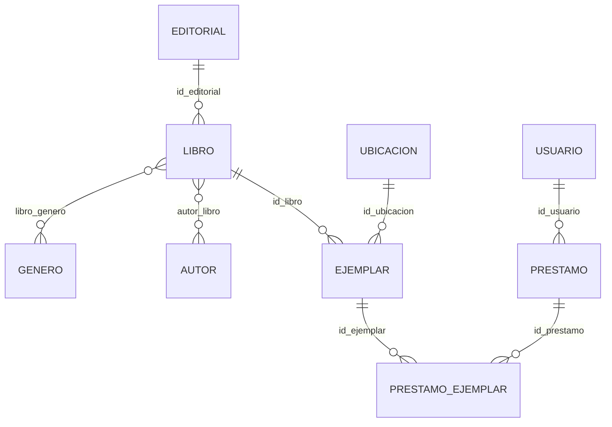
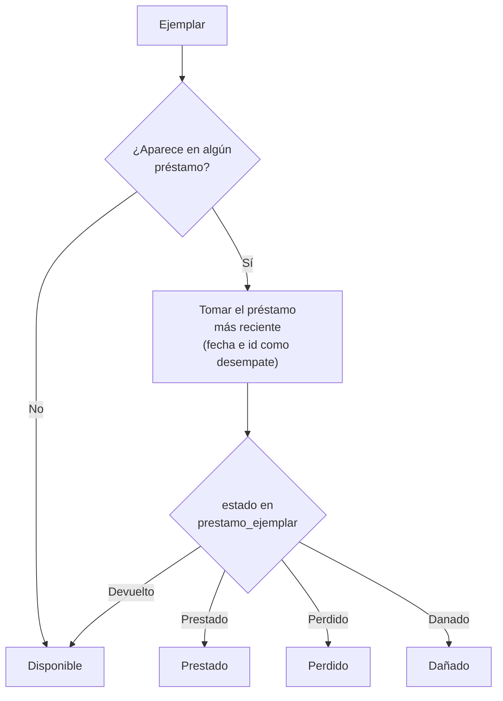

# IA con Python — Análisis de datos de la Biblioteca Cotecnova

Proyecto en Python (dockerizado) que carga las tablas de una biblioteca universitaria, calcula la **disponibilidad y ubicación de los ejemplares** para alimentar un chatbot, y hace un **análisis exploratorio (EDA)** de la relación entre stock y préstamos.

> Este documento reúne cuatro cosas: la **descripción y arquitectura del proyecto**, la **historia de cómo se construyó**, la **explicación de cada función del código** y el **análisis de resultados**, con sus limitaciones y próximos pasos.

---

## Tabla de contenido

1. [Descripción general](#1-descripción-general)
2. [Historia del proyecto](#2-historia-del-proyecto)
3. [Estructura del repositorio](#3-estructura-del-repositorio)
4. [Los datos](#4-los-datos)
5. [Cómo ejecutarlo](#5-cómo-ejecutarlo)
6. [Arquitectura y decisiones de diseño](#6-arquitectura-y-decisiones-de-diseño)
7. [Explicación del código, función por función](#7-explicación-del-código-función-por-función)
8. [Del análisis al chatbot: cómo se usarían las funciones](#8-del-análisis-al-chatbot-cómo-se-usarían-las-funciones)
9. [Análisis de resultados](#9-análisis-de-resultados)
10. [Cómo interpretar los resultados (limitaciones)](#10-cómo-interpretar-los-resultados-limitaciones)
11. [Observaciones y mejoras pendientes](#11-observaciones-y-mejoras-pendientes)
12. [Próximos pasos](#12-próximos-pasos)
13. [Apéndice: reproducir las cifras complementarias](#13-apéndice-reproducir-las-cifras-complementarias)


## 1. Descripción general

### ¿Qué problema resuelve?

Una biblioteca universitaria necesita responder con rapidez preguntas como:

- *¿Está disponible este libro hoy? ¿En qué zona y estante lo encuentro?*
- *¿Cuáles son los libros más solicitados?*
- *¿Hay títulos que nunca salen de la estantería, o títulos que se agotan constantemente?*

El proyecto parte de las tablas de la base de datos de la biblioteca (exportadas como CSV) y responde esas preguntas en dos frentes:

| Frente | Script | Pregunta que responde | Salida |
|---|---|---|---|
| **Chatbot** | `analisis_chatbot.py` | ¿Qué ejemplares están disponibles, prestados, perdidos o dañados, y dónde están? | Texto en consola + 3 gráficos en `outputs/` |
| **EDA** | `eda_proyecto.py` | ¿Cómo se relacionan el stock de un libro y sus préstamos? ¿Qué títulos conviene reforzar? | Texto en consola + 2 gráficos en `outputs/graficos/` |

### Idea central

La base de datos **no guarda directamente** si un ejemplar está disponible. Ese dato hay que **deducirlo**: se mira el préstamo más reciente de cada ejemplar y se interpreta su estado (`Devuelto`, `Prestado`, `Perdido`, `Danado`). Casi todo el módulo del chatbot gira alrededor de esa deducción.

### Tecnologías

- **Python 3.12** (imagen `python:3.12-slim`).
- **Librería estándar** (`csv`, `os`, `collections`) para leer y cruzar los datos.
- **NumPy** para la estadística (promedio, máximo, mínimo, desviación, correlación).
- **Matplotlib** para los gráficos.
- **Docker / Docker Compose** para un entorno reproducible.


## 2. Historia del proyecto

El proyecto se construyó por etapas:

1. **Primer commit: el entorno.** Se partió de la estructura propuesta por el profesor: `Dockerfile`, `docker-compose.yml`, `requirements.txt`, `.dockerignore`, `.gitignore` y las carpetas `data/`, `notebooks/`, `src/` y `outputs/`. Aquí todavía no había código de análisis, solo el esqueleto para trabajar de forma reproducible.
2. **Paso a Visual Studio Code y arranque del código.** Con el entorno listo, se cargó el proyecto en VS Code y se empezó a programar.
3. **`cargar_datos.py`.** Fue el primer script: lee los 11 CSV y muestra qué columnas y cuántas filas tiene cada tabla. Sirve de base para todos los demás.
4. **`analisis_chatbot.py`.** Reúne las funciones que responden preguntas típicas de un usuario de la biblioteca: qué libros se prestan más, cuántos ejemplares no están disponibles y en qué zonas, qué libros no tienen ningún ejemplar disponible, etc.
5. **`eda_proyecto.py`.** El análisis exploratorio: estadística descriptiva (promedio, máximo, mínimo, desviación estándar), relación entre stock y préstamos y candidatos a comprar más ejemplares.
6. **`main.py`.** El punto de entrada que orquesta la carga de datos y el análisis para el chatbot.


## 3. Estructura del repositorio

```
ia-python-biblioteca/
├── Dockerfile               # Imagen Python 3.12-slim; copia src/ y ejecuta main.py
├── docker-compose.yml       # Contenedor "ia_python_biblioteca" con volúmenes
├── requirements.txt         # numpy, pandas, matplotlib, scikit-learn, jupyter
├── .dockerignore
├── .gitignore
├── data/                    # 11 archivos CSV (tablas de la biblioteca)
├── notebooks/               # Cuadernos Jupyter (montada en docker-compose)
├── outputs/                 # Gráficos generados
│   ├── estado_ejemplares.png
│   ├── no_disponibles_por_zona.png
│   ├── top_libros_prestados.png
│   └── graficos/
│       ├── distribucion_prestamos.png
│       └── stock_vs_prestamos.png
└── src/
    ├── main.py              # Punto de entrada
    ├── cargar_datos.py      # Lectura de CSV y resumen de tablas
    ├── analisis_chatbot.py  # Disponibilidad, ubicación y libros más prestados
    └── eda_proyecto.py      # Estadística descriptiva y hallazgos
```


## 4. Los datos

La carpeta `data/` contiene 11 tablas que forman el modelo de la biblioteca (registros contados con `cargar_datos.py`):

| Tabla | Filas | Columnas | Qué contiene |
|---|---:|---:|---|
| `autor` | 350 | 7 | Autores: nombres, apellidos, nacionalidad y fecha de nacimiento |
| `autor_libro` | 1 644 | 2 | Relación muchos a muchos entre autores y libros |
| `editorial` | 40 | 2 | Editoriales |
| `ejemplar` | 2 641 | 18 | Copias físicas de cada libro: ubicación, valor, código de barras, signatura, etc. |
| `genero` | 30 | 2 | Géneros literarios y áreas académicas |
| `libro` | 1 200 | 7 | Títulos, descripción, ISBN, editorial y **stock** |
| `libro_genero` | 1 257 | 2 | Relación muchos a muchos entre libros y géneros |
| `prestamo` | 900 | 7 | Préstamos: usuario, fechas de préstamo, devolución y límite, multa |
| `prestamo_ejemplar` | 1 258 | 3 | Ejemplares incluidos en cada préstamo y su **estado** (Devuelto, Prestado, Perdido, Danado) |
| `ubicacion` | 60 | 2 | Ubicación física: "Zona A - Estante 1 - Nivel 1" (6 zonas × 10 ubicaciones) |
| `usuario` | 400 | 12 | Usuarios con su rol (Bibliotecario, Externo, Estudiante, Docente, Administrativo) |


### Relaciones principales



### Diccionario de las columnas que usa el código

Aunque los CSV tienen más columnas, el análisis se apoya solo en estas:

| Tabla | Columna | Significado y uso |
|---|---|---|
| `libro` | `id_libro`, `titulo` | Identificador y nombre del libro (se usa en todos los resultados) |
| `libro` | `stock` | Número de ejemplares que tiene el libro (variable del EDA) |
| `ejemplar` | `id_ejemplar`, `id_libro` | Copia física y libro al que pertenece |
| `ejemplar` | `id_ubicacion` | Enlaza la copia con su estantería (`ubicacion.id`) |
| `ubicacion` | `id`, `descripcion` | Texto tipo `Zona A - Estante 1 - Nivel 1`; de aquí se extrae la zona |
| `prestamo` | `id_prestamo`, `fecha_prestamo` | Identificador y fecha (formato ISO `AAAA-MM-DD`), base para saber cuál es el préstamo más reciente |
| `prestamo_ejemplar` | `id_prestamo`, `id_ejemplar` | Une un préstamo con las copias que incluye (un préstamo puede tener 1 a 3) |
| `prestamo_ejemplar` | `estado` | `Devuelto`, `Prestado`, `Perdido` o `Danado`; es lo que determina la disponibilidad |

### Reglas que se observan en los datos

- Cada préstamo incluye **1, 2 o 3 ejemplares** (621, 200 y 79 préstamos respectivamente).
- El **plazo** entre `fecha_prestamo` y `fecha_limite` es de 7, 14, 21 o 30 días.
- La **multa** es de **500 por cada día de retraso** (mismo valor en todos los préstamos devueltos tarde).
- Un ejemplar con estado `Prestado` nunca tiene `fecha_devolucion`, y uno `Devuelto` siempre la tiene: las dos columnas son coherentes entre sí.
- Los 1 200 libros tienen al menos un ejemplar y el `stock` coincide con el número real de ejemplares.


## 5. Cómo ejecutarlo

### Con Docker (recomendado)

```bash
docker compose up -d --build
docker compose exec python python src/main.py           # resumen de datos + análisis del chatbot
docker compose exec python python src/eda_proyecto.py   # análisis exploratorio (EDA)
```

El contenedor arranca con `tail -f /dev/null` para mantenerse vivo; los comandos se ejecutan con `exec`. Los volúmenes (`src`, `notebooks`, `data`, `outputs`) hacen que los cambios en el código y los gráficos generados aparezcan directamente en tu carpeta local.

Para apagar el entorno:

```bash
docker compose down
```

### Sin Docker

```bash
pip install -r requirements.txt
python src/main.py
python src/eda_proyecto.py
```

Los scripts calculan sus rutas a partir de la ubicación del propio archivo, así que funcionan sin importar desde qué carpeta se ejecuten.

### Qué debería verse

`main.py` imprime primero el resumen de las 11 tablas y luego el análisis del chatbot. Un extracto de la salida esperada:

```
Estado de 2641 ejemplares:
  Disponible: 2430 (92.0%)
  Prestado: 181 (6.9%)
  Perdido: 15 (0.6%)
  Dañado: 15 (0.6%)

Libros sin ningún ejemplar disponible hoy: 42 de 1200 (3.5%)
```

`eda_proyecto.py` imprime la estadística descriptiva y los tres hallazgos (ver [sección 9](#9-análisis-de-resultados)).

---

## 6. Arquitectura y decisiones de diseño

`cargar_datos.py` es la base: los otros dos módulos de análisis importan `cargar_todo()` y trabajan sobre el diccionario que devuelve. `main.py` solo orquesta; `eda_proyecto.py` se ejecuta aparte.

### Cómo se decide si un ejemplar está disponible



### Decisiones de diseño

| Decisión | Motivo | Consecuencia |
|---|---|---|
| **Leer los CSV con el módulo `csv`, sin pandas** | Mantener el código simple y didáctico; los datos son pequeños (el CSV más grande pesa ~400 KB) | Cada tabla es una lista de diccionarios y todos los valores llegan como **texto**; hay que convertir a `int`/`float` cuando se necesita |
| **Cruzar tablas con diccionarios** (`id → valor`) | Buscar por id es inmediato; evita recorrer una tabla completa por cada fila | Código corto y rápido para este tamaño de datos |
| **Comparar fechas como texto** | Las fechas vienen en formato ISO `AAAA-MM-DD`, cuyo orden alfabético coincide con el cronológico | No hace falta convertir a `datetime`; el `id_prestamo` desempata fechas iguales |
| **`matplotlib.use("Agg")`** | Genera imágenes sin necesitar pantalla | Imprescindible dentro de Docker; los gráficos se guardan como PNG |
| **Rutas relativas al archivo** (`os.path.dirname(__file__)`) | No depender del directorio desde el que se ejecuta | Funciona igual con Docker, sin Docker o desde otra carpeta |
| **NumPy para las estadísticas** | Cálculo vectorizado y funciones ya probadas (`mean`, `std`, `corrcoef`) | La desviación es la poblacional (`ddof=0`) |
| **Dos scripts de análisis separados** | Separar "qué responde el chatbot" de "qué descubre el análisis" | `main.py` no ejecuta el EDA (ver [sección 11](#11-observaciones-y-mejoras-pendientes)) |


## 7. Explicación del código, función por función

Formato de los datos que circulan entre funciones: cada tabla es una **lista de diccionarios** (`datos["libro"][0]["titulo"]`), y los ids son **texto** (`"245"`, no `245`).

### 7.1 `src/cargar_datos.py`

Lee los CSV de `data/` usando el módulo estándar `csv` (sin pandas). Cada tabla se representa como una **lista de diccionarios**, uno por fila, con los nombres de columna como claves.

| Función | Recibe | Devuelve |
|---|---|---|
| `leer_datos(nombre_archivo)` | Nombre de un CSV | Lista de diccionarios (vacía si el archivo no existe) |
| `cargar_todo()` | Nada | `{nombre_tabla: lista_de_filas}` |
| `mostrar_resumen(datos)` | El diccionario de tablas | Nada (imprime en consola) |

**Constantes**
- `CARPETA_DATOS`: ruta absoluta a `data/`, construida desde la ubicación del archivo.
- `ARCHIVOS_CSV`: lista con los 11 archivos que se cargan.

**`leer_datos(nombre_archivo)`**
Abre un CSV de `data/` con codificación UTF-8 y `csv.DictReader`, y devuelve la lista de diccionarios. Si el archivo no existe, captura `FileNotFoundError`, imprime un aviso y devuelve una lista vacía en lugar de detener el programa.

**`cargar_todo()`**
Recorre `ARCHIVOS_CSV`, llama a `leer_datos` para cada uno y devuelve un diccionario `{nombre_sin_extensión: lista_de_filas}`, por ejemplo `datos["libro"]` o `datos["ejemplar"]`. Es la función que usan todos los demás scripts.

**`mostrar_resumen(datos)`**
Imprime, por cada tabla, cuántos registros y cuántas columnas tiene, junto con los nombres de las columnas (tomados de las claves de la primera fila). Si una tabla está vacía, muestra 0 columnas.

También se puede ejecutar solo: `python src/cargar_datos.py` imprime el resumen sin correr ningún análisis.

### 7.2 `src/analisis_chatbot.py`

Responde preguntas de disponibilidad y ubicación. Guarda sus gráficos en `outputs/`.

| Función | Recibe | Devuelve |
|---|---|---|
| `estado_actual_ejemplares(prestamos, prestamos_ejemplar)` | Tablas `prestamo` y `prestamo_ejemplar` | `{id_ejemplar: estado}` solo de los ejemplares con préstamos |
| `estado_de_cada_ejemplar(datos)` | Diccionario de tablas | `{id_ejemplar: estado}` de **todos** los ejemplares |
| `contar_estados(estados)` | Resultado anterior | `{estado: cantidad}` con las 4 claves siempre presentes |
| `libros_sin_disponibilidad(datos, estados)` | Tablas + estados | Lista de títulos sin ningún ejemplar disponible |
| `no_disponibles_por_zona(datos, estados)` | Tablas + estados | `{zona: cantidad}` ordenado por zona |
| `top_libros_prestados(datos, n=10)` | Tablas | Lista de `(título, préstamos)` |
| `grafico_estados` · `grafico_zonas` · `grafico_top_libros` | Los resultados anteriores | Nada (guardan un PNG) |
| `main()` | Nada | Nada (imprime el informe y genera los gráficos) |

**`estado_actual_ejemplares(prestamos, prestamos_ejemplar)`**
Determina el estado de cada ejemplar según su **préstamo más reciente**. Primero arma un diccionario `id_prestamo → (fecha_prestamo, id_prestamo)`; como las fechas están en formato ISO (`AAAA-MM-DD`), comparar los textos equivale a comparar fechas, y el id sirve de desempate. Luego recorre `prestamo_ejemplar` y, para cada ejemplar, conserva el estado del préstamo con la clave más alta. Devuelve `{id_ejemplar: estado}`; los ejemplares que nunca se han prestado no aparecen.

**`estado_de_cada_ejemplar(datos)`**
Completa el resultado anterior para **todos** los ejemplares de `ejemplar.csv`. Reglas: un ejemplar sin préstamos, o cuyo último préstamo fue devuelto (`Devuelto`), queda **Disponible**; los demás estados se traducen a `Prestado`, `Perdido` y `Dañado` (en los datos aparece como `Danado`, sin tilde). Devuelve `{id_ejemplar: estado}`.

**`contar_estados(estados)`**
Usa `Counter` para contar cuántos ejemplares hay en cada estado y devuelve siempre las cuatro claves (`Disponible`, `Prestado`, `Perdido`, `Dañado`), con 0 si alguna no aparece.

**`libros_sin_disponibilidad(datos, estados)`**
Cuenta los ejemplares disponibles por libro y devuelve los **títulos de los libros que no tienen ninguno disponible** hoy. Útil para que el chatbot responda "este libro no está disponible en este momento".

**`no_disponibles_por_zona(datos, estados)`**
Convierte cada ubicación en su zona (de `"Zona A - Estante 1 - Nivel 1"` toma `"Zona A"`) y cuenta los ejemplares **no disponibles** (prestados, perdidos o dañados) en cada una. Devuelve un diccionario ordenado por zona.

**`top_libros_prestados(datos, n=10)`**
Cuenta los préstamos de cada libro (relacionando `prestamo_ejemplar → ejemplar → libro`) y devuelve los `n` más prestados como lista de `(título, préstamos)`. Cada fila de `prestamo_ejemplar` cuenta como un préstamo del libro.

**`grafico_estados(conteo)`**
Gráfico de barras con el estado actual de los ejemplares (verde, naranja, rojo y dorado) → `outputs/estado_ejemplares.png`.

**`grafico_zonas(por_zona)`**
Gráfico de barras con los ejemplares no disponibles por zona → `outputs/no_disponibles_por_zona.png`.

**`grafico_top_libros(top)`**
Gráfico de barras horizontales con los 10 libros más prestados. Recorta los títulos de más de 40 caracteres (37 + `...`) y invierte el orden para que el más prestado quede arriba → `outputs/top_libros_prestados.png`.

**`main()`**
Orquesta el análisis: carga los datos, crea la carpeta de salida, calcula los estados, imprime el porcentaje por estado, los libros sin disponibilidad, los no disponibles por zona (con promedio, máximo, mínimo y desviación estándar calculados con NumPy) y el top 10, y genera los tres gráficos.

### 7.3 `src/eda_proyecto.py`

Análisis exploratorio con NumPy. Guarda sus gráficos en `outputs/graficos/`.

| Función | Recibe | Devuelve |
|---|---|---|
| `construir_stock_prestamos(libros, ejemplares, prestamos_ejemplar)` | Tres tablas | Lista `{id_libro, titulo, stock, prestamos}`, una por libro |
| `estadisticas_numpy(valores)` | Lista de números | `{promedio, maximo, minimo, desviacion}` |
| `libros_alta_demanda_bajo_stock(tabla, min_prestamos=3, max_stock=3)` | Tabla del EDA | Libros candidatos, de más a menos préstamos |
| `grafico_distribucion(tabla)` | Tabla del EDA | Nada (guarda un PNG) |
| `grafico_stock_vs_prestamos(tabla)` | Tabla del EDA | `{nivel_de_stock: promedio_de_préstamos}` (y guarda un PNG) |
| `main()` | Nada | Nada (imprime hallazgos y genera gráficos) |

**`construir_stock_prestamos(libros, ejemplares, prestamos_ejemplar)`**
Cruza `libro`, `ejemplar` y `prestamo_ejemplar` para producir una tabla con una fila por libro: `{id_libro, titulo, stock, prestamos}`. El stock viene de `libro.csv` y los préstamos se cuentan pasando de cada préstamo a su ejemplar y de este a su libro. Los libros sin préstamos quedan con 0.

**`estadisticas_numpy(valores)`**
Recibe una lista de números y devuelve un diccionario con `promedio`, `maximo`, `minimo` y `desviacion`. La desviación es la **poblacional** (`np.std` con `ddof=0`, el valor por defecto de NumPy).

**`libros_alta_demanda_bajo_stock(tabla, min_prestamos=3, max_stock=3)`**
Filtra con una máscara booleana de NumPy los libros con al menos `min_prestamos` préstamos y como máximo `max_stock` ejemplares, y los ordena de mayor a menor número de préstamos. Son los candidatos a comprar más copias. Los umbrales (3 y 3) son parámetros: se pueden ajustar para una lista más corta o más amplia.

**`grafico_distribucion(tabla)`**
Histograma de cuántos libros tienen 0, 1, 2… préstamos → `outputs/graficos/distribucion_prestamos.png`.

**`grafico_stock_vs_prestamos(tabla)`**
Calcula el promedio de préstamos para cada nivel de stock (1 a 5 ejemplares), lo grafica en barras → `outputs/graficos/stock_vs_prestamos.png` y devuelve el diccionario `{nivel: promedio}` para imprimirlo.

**`main()`**
Construye la tabla, imprime las estadísticas de `stock` y `prestamos`, el **Hallazgo 1** (libros que nunca se han prestado), el **Hallazgo 2** (promedio por nivel de stock y correlación de Pearson con `np.corrcoef`), genera los gráficos y lista los primeros 5 candidatos a comprar más ejemplares.

### 7.4 `src/main.py`

**`main()`**
Punto de entrada. Imprime el encabezado del sistema y ejecuta dos pasos:
1. `cargar_datos.cargar_todo()` y `cargar_datos.mostrar_resumen(datos)` → resumen de tablas, filas y columnas.
2. `analisis_chatbot.main()` → análisis de disponibilidad y ubicación.

> `eda_proyecto.py` **no** se invoca desde `main.py`; se ejecuta por separado (ver [sección 5](#5-cómo-ejecutarlo)).

Nótese que `analisis_chatbot.main()` vuelve a llamar a `cargar_todo()`, así que en `main.py` los CSV se leen dos veces. Con estos volúmenes no se nota, pero es un punto a mejorar (ver [sección 11](#11-observaciones-y-mejoras-pendientes)).

### 7.5 Archivos de configuración

**`Dockerfile`**

| Línea | Qué hace |
|---|---|
| `FROM python:3.12-slim` | Parte de una imagen ligera de Python 3.12 |
| `WORKDIR /app` | Trabaja dentro de `/app` |
| `COPY requirements.txt .` + `RUN pip install ...` | Instala las dependencias primero, para que Docker reutilice esa capa si solo cambia el código |
| `COPY src/ ./src/` | Copia el código (no copia `data/`, ver [sección 11](#11-observaciones-y-mejoras-pendientes)) |
| `CMD ["python", "src/main.py"]` | Comando por defecto al ejecutar la imagen sola |

**`docker-compose.yml`**
Define un servicio `python` con contenedor `ia_python_biblioteca`. Monta cuatro volúmenes (`src`, `notebooks`, `data`, `outputs`) para editar el código y ver los resultados desde la máquina local sin reconstruir la imagen, y sustituye el `CMD` por `tail -f /dev/null` para que el contenedor quede activo y se le envíen comandos con `docker compose exec`.

**`requirements.txt`**: `numpy`, `pandas`, `matplotlib`, `scikit-learn` y `jupyter`, sin versiones fijadas.


## 8. Del análisis al chatbot: cómo se usarían las funciones

El proyecto **no incluye todavía el chatbot** en sí: prepara la lógica de datos que este necesitaría. Así se relaciona cada pregunta típica con lo que ya existe:

| Pregunta del usuario | Función que aporta la respuesta | Ejemplo de respuesta |
|---|---|---|
| "¿Está disponible *X*?" | `estado_de_cada_ejemplar` + conteo de ejemplares `Disponible` del libro | "Hay 1 de 4 ejemplares disponible" |
| "¿Por qué no lo encuentro?" | `libros_sin_disponibilidad` | "En este momento todos sus ejemplares están prestados, perdidos o dañados" |
| "¿Dónde está?" | `ejemplar.id_ubicacion` → `ubicacion.descripcion` | "Zona D - Estante 5 - Nivel 2" |
| "¿Qué es lo más leído?" | `top_libros_prestados` | "El más prestado es *Realidad Aumentada: teoria y practica* (7 préstamos)" |
| "¿Qué zona tiene más libros fuera?" | `no_disponibles_por_zona` | "La Zona F (53 ejemplares)" |

La tercera fila (ubicación exacta de cada ejemplar) no está implementada como función; hoy el código solo agrupa por zona. Un ejemplo de cómo se podría construir con las piezas existentes:

```python
from cargar_datos import cargar_todo
from analisis_chatbot import estado_de_cada_ejemplar


def buscar_libro(titulo, datos, estados):
    """Disponibilidad y ubicación de los ejemplares de un título."""
    ubicacion_de = {u["id"]: u["descripcion"] for u in datos["ubicacion"]}
    ids = {l["id_libro"] for l in datos["libro"] if titulo.lower() in l["titulo"].lower()}
    return [
        {"ejemplar": e["id_ejemplar"],
         "estado": estados[e["id_ejemplar"]],
         "ubicacion": ubicacion_de[e["id_ubicacion"]]}
        for e in datos["ejemplar"] if e["id_libro"] in ids
    ]


datos = cargar_todo()
estados = estado_de_cada_ejemplar(datos)
for fila in buscar_libro("Fundamentos de Impuestos", datos, estados):
    print(fila)
```

Con los datos actuales devuelve, por ejemplo:

```
{'ejemplar': '2095', 'estado': 'Prestado', 'ubicacion': 'Zona D - Estante 3 - Nivel 2'}
{'ejemplar': '2096', 'estado': 'Prestado', 'ubicacion': 'Zona F - Estante 2 - Nivel 2'}
{'ejemplar': '2097', 'estado': 'Disponible', 'ubicacion': 'Zona D - Estante 5 - Nivel 2'}
{'ejemplar': '2098', 'estado': 'Prestado', 'ubicacion': 'Zona A - Estante 2 - Nivel 1'}
```

> Este fragmento es un **ejemplo ilustrativo**: no forma parte del repositorio actual. Para probarlo, ejecútalo desde `src/`.


## 9. Análisis de resultados

### 9.1 Estado actual de los ejemplares

El estado de cada uno de los 2 641 ejemplares se define por su préstamo más reciente:

| Estado | Ejemplares | % |
|---|---:|---:|
| Disponible | 2 430 | 92,0 % |
| Prestado | 181 | 6,9 % |
| Perdido | 15 | 0,6 % |
| Dañado | 15 | 0,6 % |


**42 de los 1 200 libros (3,5 %)** no tienen ningún ejemplar disponible hoy. Casi todo el inventario se puede prestar, y lo que falta se concentra en unos pocos títulos.

Un detalle útil para el chatbot: **31 de esos 42 libros (73,8 %) tienen un solo ejemplar**. Son títulos que se quedan sin disponibilidad por tener poco stock, no necesariamente por tener mucha demanda. Los otros 11 tienen entre 2 y 4 ejemplares, todos fuera de la estantería.

### 9.2 Ejemplares no disponibles por zona

| Zona | Ejemplares en la zona | No disponibles | % no disponible |
|---|---:|---:|---:|
| A | 438 | 35 | 8,0 % |
| B | 418 | 21 | 5,0 % |
| C | 452 | 24 | 5,3 % |
| D | 438 | 40 | 9,1 % |
| E | 448 | 38 | 8,5 % |
| F | 447 | 53 | 11,9 % |

Promedio por zona: **35,2**, máximo 53 (Zona F), mínimo 21 (Zona B), desviación 10,6. Las zonas tienen una cantidad de ejemplares parecida (entre 418 y 452), así que los conteos absolutos son comparables: la **Zona F** concentra más ejemplares fuera de la estantería y la **Zona B** menos. *(La columna de porcentaje es un cálculo complementario; el script actual imprime solo los conteos.)*


### 9.3 Libros más prestados

| # | Título | Préstamos |
|---:|---|---:|
| 1 | Realidad Aumentada: teoria y practica | 7 |
| 2 | Introduccion a Contabilidad Tributaria | 7 |
| 3 | Conceptos Clave de Multimedia Interactiva | 6 |
| 4 | Camino infinito | 6 |
| 5 | Guia Practica de Recursos Humanos | 6 |
| 6 | Fundamentos de Impuestos | 6 |
| 7 | Contabilidad Tributaria: teoria y practica | 6 |
| 8 | Fundamentos de Nutricion Animal | 5 |
| 9 | Produccion Agricola para Profesionales | 5 |
| 10 | Contabilidad Publica Aplicada | 5 |

Hay un tema recurrente: **contabilidad e impuestos** aparece en cuatro de los diez títulos.


### 9.4 Análisis exploratorio (EDA)

Estadística descriptiva sobre los 1 200 libros:

| Variable | Promedio | Máximo | Mínimo | Desviación |
|---|---:|---:|---:|---:|
| Stock | 2,20 | 5 | 1 | 1,19 |
| Préstamos | 1,05 | 7 | 0 | 1,16 |

La distribución del stock es: 1 ejemplar en 439 libros (36,6 %), 2 en 332, 3 en 247, 4 en 113 y 5 en 69. Más de la mitad del catálogo tiene 1 o 2 ejemplares.

**Hallazgo 1 — Muchos libros nunca se prestan.** 479 de 1 200 libros (**39,9 %**) no tienen ningún préstamo registrado. Con un promedio de apenas 1,05 préstamos por libro y una desviación similar, la demanda parece concentrada en pocos títulos (pero ver [sección 9.6](#96-verificación-complementaria-qué-tan-especial-es-la-demanda)).


**Hallazgo 2 — A más stock, más préstamos.** El promedio de préstamos sube de forma constante con el stock:

| Stock | 1 | 2 | 3 | 4 | 5 |
|---|---:|---:|---:|---:|---:|
| Préstamos promedio | 0,45 | 0,95 | 1,52 | 1,87 | 2,29 |

La correlación stock–préstamos es **0,49** (moderada). Ojo con la interpretación: un libro con más ejemplares tiene más oportunidades de prestarse, así que esta relación no prueba que el stock cause la demanda.


**Hallazgo 3 — Candidatos a comprar más ejemplares.** 65 libros tienen 3 o más préstamos y stock de 3 o menos. Los cinco con más demanda:

| Título | Stock | Préstamos |
|---|---:|---:|
| Contabilidad Tributaria: teoria y practica | 2 | 6 |
| Conceptos Clave de Multimedia Interactiva | 3 | 6 |
| Fundamentos de Nutricion Animal | 3 | 5 |
| Fotografia Digital Aplicada | 3 | 5 |
| Fundamentos de Edicion de Video | 2 | 4 |

### 9.5 Análisis complementario de préstamos, usuarios y multas

Estas cifras **no las calculan los scripts actuales**; salen de los mismos CSV y se pueden reproducir con el [apéndice](#13-apéndice-reproducir-las-cifras-complementarias).

**Actividad estable en el tiempo.** Los préstamos por año son 235 (2022), 226 (2023), 211 (2024) y 228 (2025): unos 225 al año, sin una tendencia clara de crecimiento o caída.

**Uso similar entre roles.** Los préstamos totales por rol son Externo 208, Bibliotecario 203, Estudiante 181, Docente 180 y Administrativo 128. Como cada rol tiene un número distinto de usuarios, conviene mirar el promedio por usuario, que es parejo:

| Rol | Usuarios | Préstamos | Préstamos por usuario |
|---|---:|---:|---:|
| Docente | 76 | 180 | 2,37 |
| Estudiante | 77 | 181 | 2,35 |
| Externo | 92 | 208 | 2,26 |
| Bibliotecario | 92 | 203 | 2,21 |
| Administrativo | 63 | 128 | 2,03 |

**Devoluciones tardías.** De los 900 préstamos, 711 tienen fecha de devolución y **367 (51,6 %)** se devolvieron después de la fecha límite. El retraso promedio es de unos 13,6 días. Las multas suman **2 488 000** (en la moneda de los datos, que no se especifica) a razón de 500 por día de retraso.

**Préstamos sin cerrar.** 189 préstamos (21,0 %) no tienen fecha de devolución. Es lo que explica los ejemplares `Prestado`, y tiene una consecuencia importante que se comenta en la [sección 10](#10-cómo-interpretar-los-resultados-limitaciones).

### 9.6 Verificación complementaria: ¿qué tan especial es la demanda?

El Hallazgo 2 muestra que el promedio de préstamos crece con el stock. Si se divide por el número de ejemplares, la demanda **por ejemplar** es casi la misma en todos los niveles:

| Stock | 1 | 2 | 3 | 4 | 5 |
|---|---:|---:|---:|---:|---:|
| Préstamos por ejemplar | 0,45 | 0,48 | 0,51 | 0,47 | 0,46 |

En otras palabras, cada ejemplar se presta en promedio unas **0,48 veces** (1 258 préstamos entre 2 641 ejemplares), sin importar cuántas copias tenga su título. Para comprobar qué tan compatible es esto con el azar, se simularon 500 repeticiones en las que los 1 258 préstamos se reparten **al azar entre todos los ejemplares**:

| Indicador | Datos reales | Simulación al azar (promedio; rango en 500 repeticiones) |
|---|---:|---:|
| Libros sin ningún préstamo | 39,9 % | 40,3 % (37,3 % – 43,1 %) |
| Máximo de préstamos en un libro | 7 | 7,2 (5 – 13) |
| Correlación stock–préstamos | 0,49 | 0,49 (0,41 – 0,55) |

Los tres indicadores reales caen dentro del rango de la simulación. **Esto no prueba que los préstamos sean aleatorios**, pero indica que, en estos datos, las diferencias entre títulos son compatibles con lo que produciría el azar: no hay señal clara de títulos con una demanda "propia" superior. Es coherente con un conjunto de datos de práctica (por ejemplo, el campo `observaciones` contiene texto de relleno en latín). Las consecuencias para la lectura de los resultados están en la sección siguiente.

### 9.7 Conclusiones

- La biblioteca tiene una disponibilidad alta (92 %), pero 42 títulos no se pueden prestar hoy, y casi tres de cada cuatro de ellos tienen un solo ejemplar.
- Los ejemplares no disponibles se reparten de forma desigual entre zonas: la Zona F (53) tiene más del doble que la Zona B (21).
- Cerca del 40 % del catálogo nunca se presta, mientras unos pocos títulos llegan a 6 o 7 préstamos. Esa concentración, sin embargo, es del tamaño que se esperaría por azar (sección 9.6).
- El stock explica buena parte de las diferencias entre títulos: cada ejemplar se presta con una frecuencia parecida, así que los libros con más copias acumulan más préstamos.
- Hay una lista concreta de 65 libros con 3 o más préstamos y 3 o menos ejemplares que sirve como punto de partida para decidir compras, siempre con las salvedades de la sección siguiente.
- La mitad de los préstamos devueltos llegan tarde, y hay un 21 % de préstamos sin cerrar: un dato de calidad y de gestión que el chatbot podría aprovechar (recordatorios de devolución).


Como la simulación usa números aleatorios, los valores pueden variar ligeramente; con `default_rng(0)` deberían acercarse a 0,40, 7,2 y 0,49.
